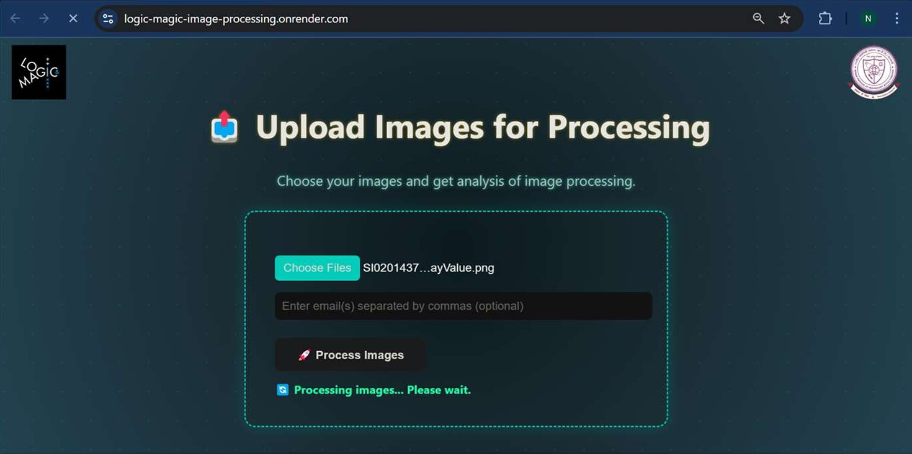
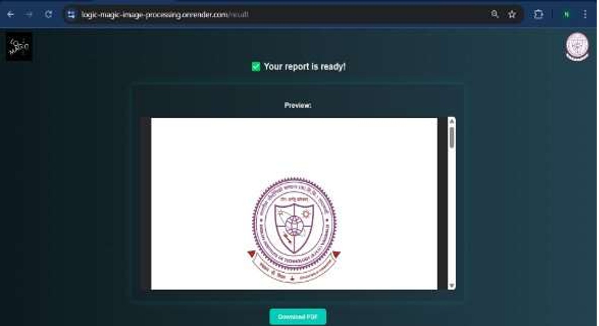

# 🧪 Flask Image Reporter

A Flask web app that detects defects in Laser Powder Bed Fusion (L-PBF) parts using OpenCV.  
It analyzes image regions, computes stats, and generates automated PDF reports with overlays.

## 🔍 Features

- Upload grayscale L-PBF images
- Extract contours & compute:
  - Area
  - Region-wise mean & variance
- Generate downloadable PDF reports
- Automatically send reports via email

## 💻 Tech Stack

- Python, Flask
- OpenCV, NumPy
- SMTP (email automation)

## 🚀 Live Demo

🔗 [Try the App](https://logic-magic-image-processing.onrender.com)

## 📸 Screenshots

### 🔼 Image Upload Interface


### 🧾 Defect Report Output


## 📦 Setup Instructions

```bash
git clone https://github.com/Saatu23/flask_image_reporter.git
cd flask_image_reporter
pip install -r requirements.txt
python app.py
```

### 🙋‍♂️ Author

**Satyam Kumar Mishra**  
📧 satyammishra20102004@gmail.com  
🔗 [GitHub](https://github.com/Saatu23)
